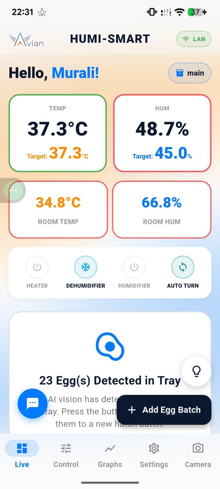
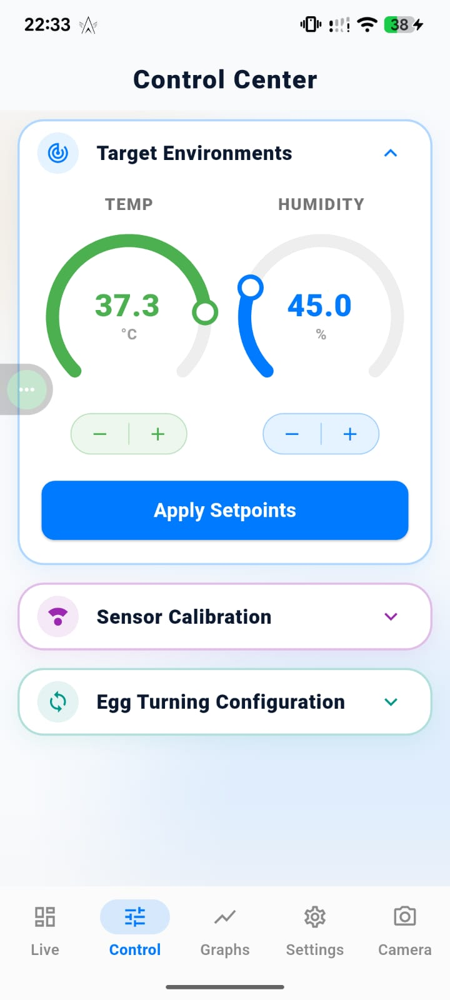
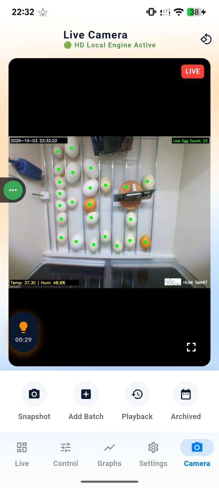
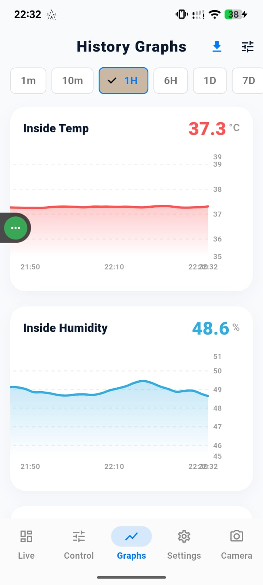
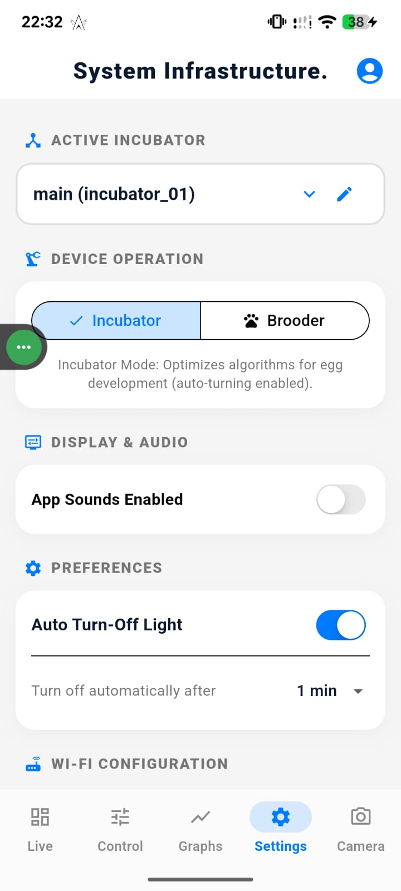

# Smart IoT Incubator (HUMI-SMART)
### Flutter + Raspberry Pi + Edge AI

A complete end-to-end IoT Smart Incubator system with real-time monitoring, remote control, live camera streaming, and AI-powered egg/chick detection.

---

## Features

- Real-time Temperature & Humidity monitoring and control
- Flutter mobile app with modern UI (Live Dashboard, Control Center, Graphs, Settings)
- Raspberry Pi as the main edge controller
- **AI Egg & Chick Detection** using TensorFlow Lite (running on Raspberry Pi)
- Live camera streaming with real-time object detection
- Historical graphs and data logging
- System configuration and device management

---

## Demo Video
[Watch Full Working Demo](https://www.youtube.com/playlist?list=PLBg3FyIF64JQ)

---

## Project Structure

- **flutter_app/** → Flutter mobile application (UI + basic structure)
- **raspberry_pi/** → Sample Python code for Raspberry Pi
- **ai_model/** → TensorFlow Lite model info + sample inference code
- **screenshots/** → App screenshots and project photos
- **README.md**

## Tech Stack

- **Mobile App**: Flutter (Dart)
- **Edge Computing**: Raspberry Pi (Python)
- **Microcontroller**: Arduino
- **AI**: TensorFlow Lite (Egg & Chick Detection)
- **Communication**: MQTT / HTTP / Serial
- **Camera**: Live streaming + AI vision

---

## Screenshots

### Live Dashboard

### Control Center

### AI Live Camera (Egg Detection)

### History Graphs

### Settings

---

## Note
This repository contains **partial code** for portfolio demonstration purposes.  
Full source code is available on request.

---

## Author
**Vamsi**  
IoT Developer | Flutter + Embedded Systems + Edge AI
